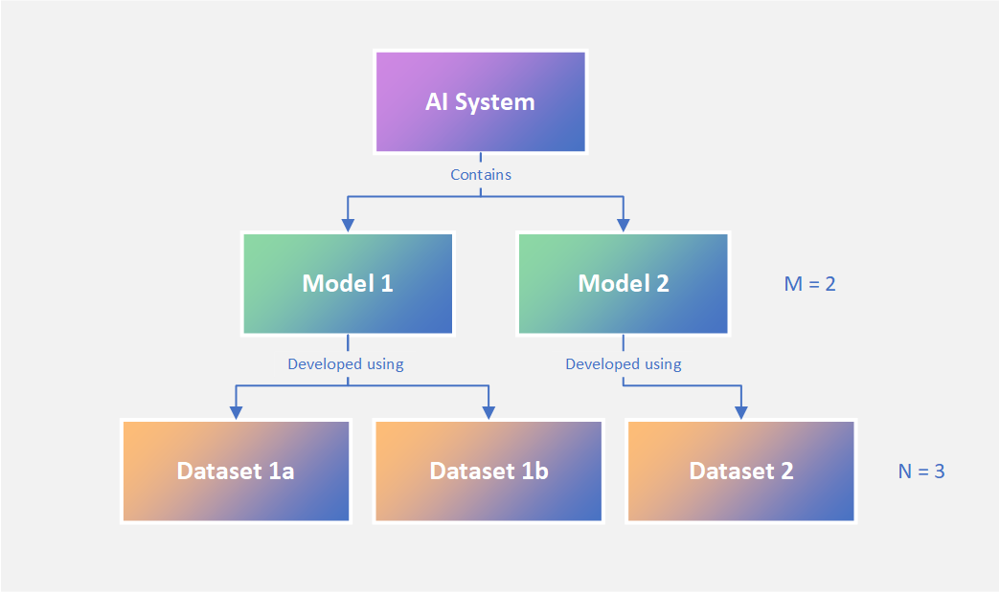
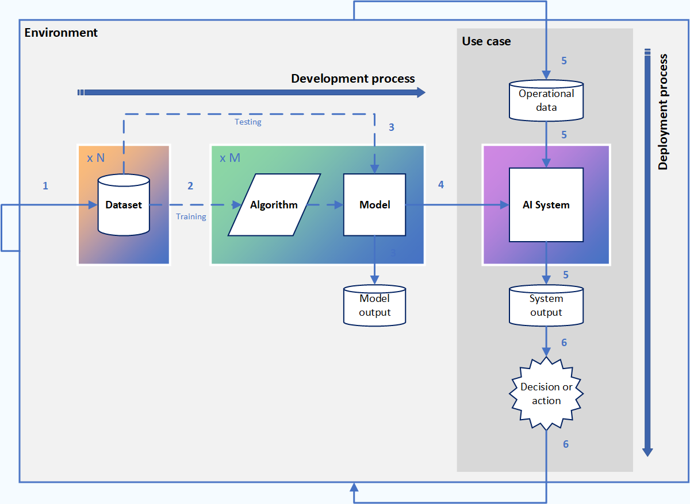

import CookieBanner from "../../components/cookies"
import OutboundLink from "../../components/outbound-link"
import Collapse from "../../components/collapse"
import License from "../../components/license"

<CookieBanner />

### Design

<Collapse label="A modular design…">

MC+ has a modular design to reflect with the way in which technical components of AI come together to produce an overall system.

We can imagine a single AI system (e.g. Chat-GPT) being comprised of one or more models (e.g. GPT-3 and an RLHF model) that have been developed using one or more datasets (e.g. CommonCrawl, WebText2, etc.). Cards can be created for each named technological component, meaning that multiple model and dataset cards can sit ‘underneath’ a single AI system card. This modular framing is depicted in the diagram below.

*A modular view of how AI systems are composed of models and datasets.*

</ Collapse>

<Collapse label="…to reflect the AI production cycle">

Taking a broader view of an AI system production cycle, we can see how MC+ cards aim to describe a wide array of activities and enable information flow across the development and deployment processes. A basic system diagram of the AI production cycle is depicted in Figure 2, with brief explanations of the activities represented by arrows provided in the numbered list.

*A system diagram of the AI production cycle. The numbered arrows represent the following processes:*

1. Data is collected or extracted from a physical or digital environment and assembled into computational artefacts called datasets.
2. Datasets are processed through machine learning algorithms that ‘learn’ to identify patterns in the data. The artefacts of this process are complex mathematical functions, also known as AI models.
3. Datasets are also used to validate and test how well AI models perform against certain metrics. The model outputs can be evaluated during and after model development to ensure the models perform acceptably in a non-production environment.
4. The trained AI models are packaged into a larger set of functional components, also known as an AI system, in preparation for delivery and production use.
5. Within a use case - a given set of operational conditions – the AI system is deployed by processing operational data from the environment into an output.
6. The system output is used to inform decisions or policies that often go on to shape the broader environment from which data is collected.

</ Collapse>

### Content

Each card corresponds to one named component of an AI system: a dataset, a trained model, or the system itself. Cards are split into 5-6 main sections that focus on a broad aspect of the technology. A complete list of thematic sections of the MC+ framework is presented below.

<Collapse label="Dataset card" hovercolor="var(--dataset)">

- **Dataset overview**: the high-level details of the dataset.
- **Dataset usage**: the rationale for dataset curation and use.
- **Dataset characteristics**: the characteristics of the dataset.
- **Data provenance and collection**: the data provenance and methods used to curate the dataset.
- **Data controls**: the regulatory controls applied to the dataset.

</Collapse>

<Collapse label="Model card" hovercolor="var(--model)">

- **Model overview**: the high-level features and characteristics of the model.
- **Model usage:** the scope and rationale for model use.
- **Datasets and training:** the data used to develop the model and the model training process
- **Evaluation:** the measurement of aggregate and disaggregate model performance.
- **Enabling technology and environmental impact :** the resource dependencies of the model.
- **Risks:** the risks and risk factors associated with the model, and how they have or could be mitigated against.

</Collapse>

<Collapse label="System card" hovercolor="var(--system)">

- **System overview:** the high-level features and character of the system.
- **System description:** the functional components of the system and how they relate.
- **System usage:** the scope and rationale for system use.
- **Compliance and policy:** the rules and regulations around system provision and use.
- **Performance and evaluation:** the performance of the system and how it has been tested.
- **Risks:** the risks associated with system use and how to manage them.

</Collapse>